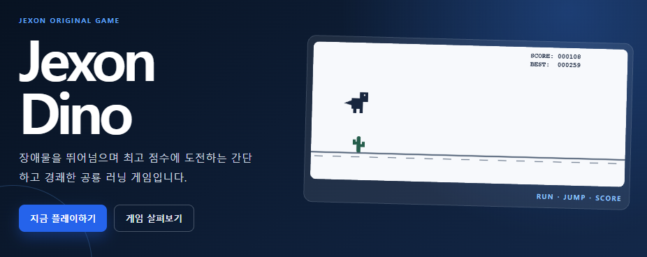
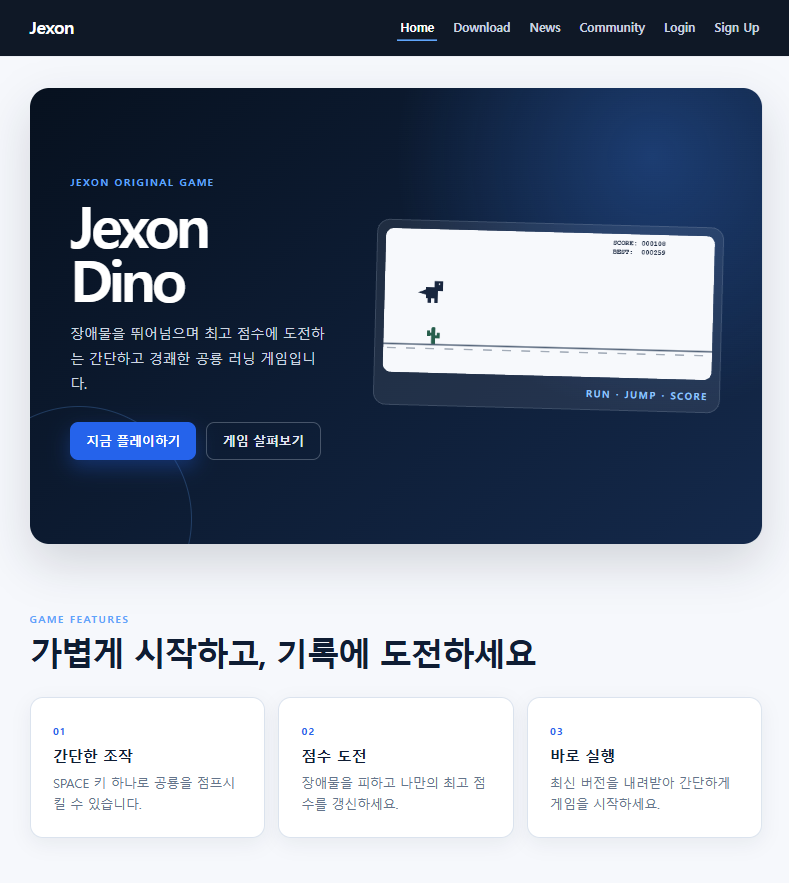
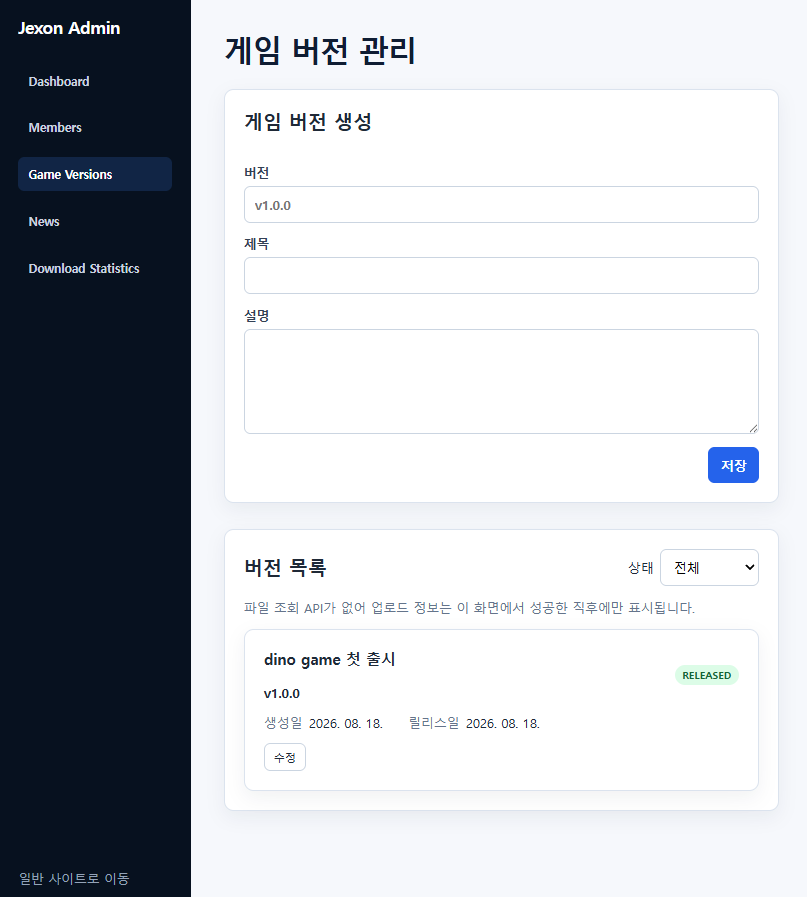
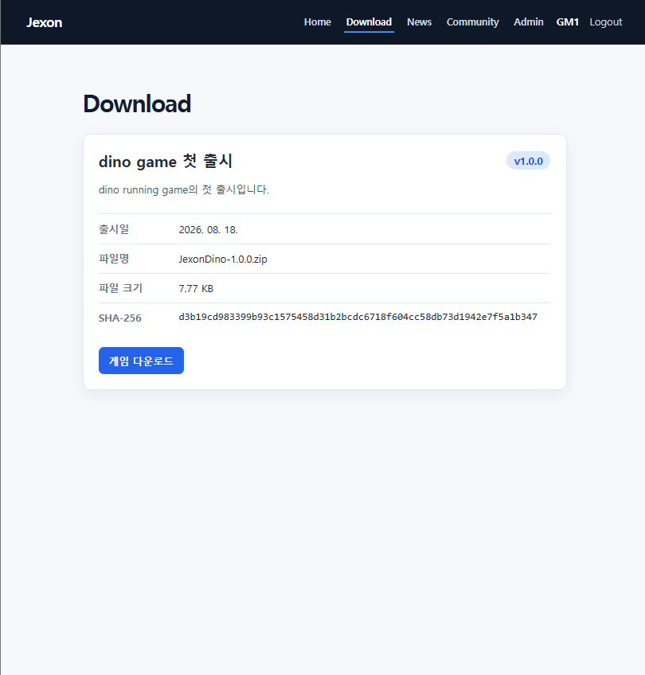
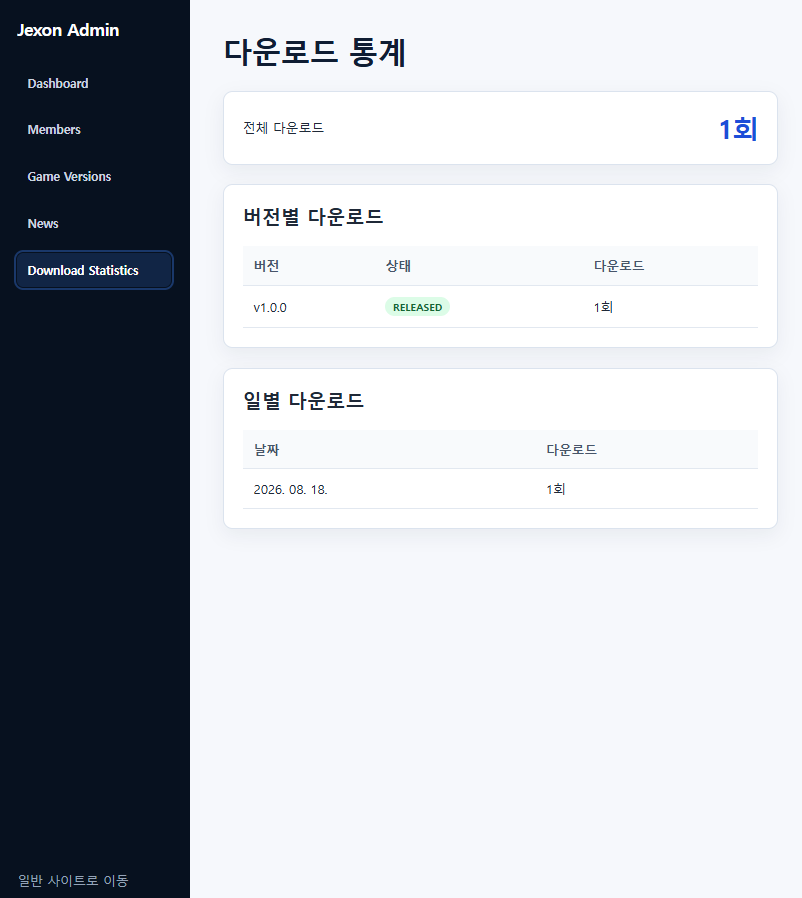
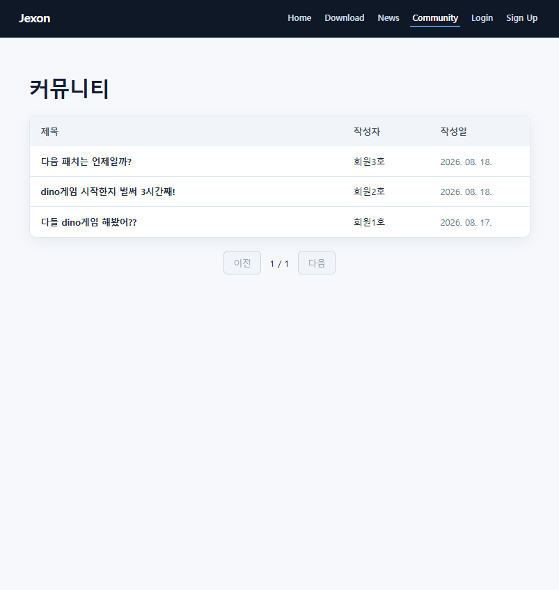
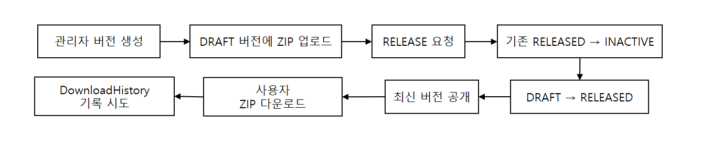
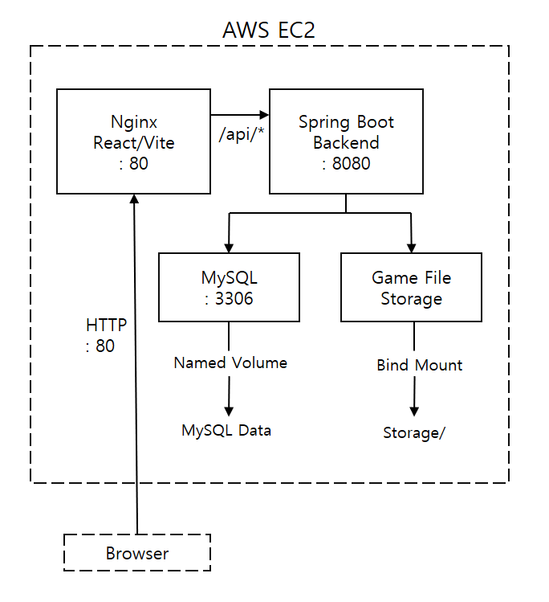
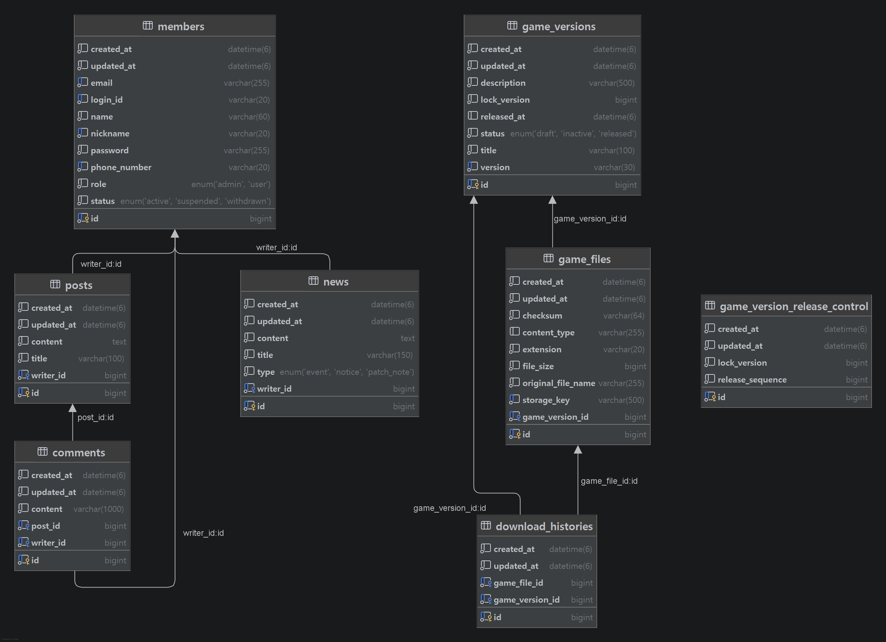

# 🦖 Jexon - 단일 게임 배포 웹 서비스 🦖

<p align="center">
  
</p>

<details>
<summary>Demo Account</summary>

일반 USER 권한으로 로그인해 세션 유지와 커뮤니티 작성 기능을 확인할 수 있습니다.

```text
ID: user1
Password: Password1234!
```

ADMIN 계정 정보는 공개하지 않습니다.

</details>

단일 게임의 공식 홈페이지를 가정해 만든 게임 소개·커뮤니티·배포 웹 서비스입니다.

- 개발 형태 : 개인 프로젝트 
- 배포 주소 : http://43.201.198.145
- 개발 기간 : 2026.07.29 ~ 2026.08.18

사용자는 새소식과 커뮤니티를 이용하고 현재 공개된 최신 게임 버전을 실제 ZIP 파일로 다운로드할 수 있습니다. 관리자는 회원과 새소식을 관리하고, 게임 버전 생성부터 ZIP 업로드·릴리스·다운로드 통계 확인까지 하나의 운영 흐름으로 처리할 수 있습니다.

## 1. 프로젝트 설계 및 구현 

### (1) 게임 버전 및 파일 관리

게임 버전은 `DRAFT → RELEASED → INACTIVE` 상태로 관리합니다. 관리자는 DRAFT 버전에 검증된 ZIP 파일 하나를 연결한 뒤 릴리스할 수 있으며, 새 버전이 RELEASED가 되면 기존 RELEASED 버전은 같은 트랜잭션에서 INACTIVE로 전환됩니다. 사용자에게는 항상 현재 RELEASED 버전 하나만 공개합니다.

서로 다른 버전을 동시에 릴리스하는 상황에서도 단일 RELEASED 상태를 지키기 위해 `GameVersion`의 낙관적 락과 singleton `GameVersionReleaseControl`을 공통 충돌 지점으로 사용합니다.

### (2) 파일과 메타데이터 분리

실제 ZIP은 `LocalFileStorage`를 통해 서버 storage에 저장하고, DB에는 원본 파일명·내부 storage key·크기·content type·SHA-256 checksum 등의 메타데이터만 저장합니다. 업로드는 전체 파일을 메모리에 올리지 않고 스트리밍하면서 실제 크기와 checksum을 계산합니다.

사용자는 서버 경로나 storage key에 직접 접근하지 않습니다. 공개 다운로드 API가 최신 버전과 물리 파일을 검증한 뒤 원본 파일명의 binary stream을 반환합니다. 파일 저장 후 DB 저장이 실패하면 남은 물리 파일을 보상 삭제합니다.

### (3) 다운로드 기록 및 통계

물리 파일을 정상적으로 연 이후 `DownloadHistory` 저장을 요청당 한 번 시도합니다. 이력 기록 때문에 사용자 다운로드가 실패하지 않도록 별도의 `REQUIRES_NEW` 트랜잭션과 `saveAndFlush()`를 사용하는 best-effort 정책을 적용했습니다.

관리자는 전체·버전별·일별 다운로드 수를 확인할 수 있습니다. 전체 엔티티를 메모리에 적재하지 않고 JPQL Projection과 MySQL `DATE()` native query로 DB에서 직접 집계합니다.

### (4) 세션 인증과 권한 정책

Spring Security session 인증을 사용하고 USER와 ADMIN 역할을 분리했습니다. 관리자 API는 Security 설정의 ADMIN 검사에 더해 Service에서 DB의 최신 `ACTIVE + ADMIN` 상태를 다시 확인합니다.

커뮤니티 글과 댓글은 작성자만 수정할 수 있고 작성자 또는 ACTIVE ADMIN이 삭제할 수 있습니다. News는 개인 게시물이 아닌 운영 콘텐츠로 보아 ACTIVE ADMIN 누구나 다른 관리자가 작성한 글까지 수정·삭제할 수 있습니다.

## 2. 주요 화면

Jexon Dino의 소개와 게임 이미지를 중심으로 구성한 공개 Home입니다. 사용자는 이 화면에서 최신 게임 다운로드, 새소식과 커뮤니티로 이동할 수 있습니다.
<p align="center">
  
</p>
<table>
  <tr>
    <td width="50%"></td>
    <td width="50%"></td>
  </tr>
  <tr>
    <td>관리자가 버전을 생성하고 ZIP을 업로드한 뒤 RELEASED 상태로 전환하는 운영 화면입니다.</td>
    <td>현재 RELEASED 버전의 파일명·크기·checksum을 확인하고 실제 ZIP을 다운로드하는 공개 화면입니다.</td>
  </tr>
  <tr>
    <td></td>
    <td></td>
  </tr>
  <tr>
    <td>DownloadHistory를 기반으로 전체·버전별·일별 다운로드 집계를 확인하는 관리자 화면입니다.</td>
    <td>비회원도 조회할 수 있고 로그인 사용자는 게시글과 댓글을 작성할 수 있는 커뮤니티 화면입니다.</td>
  </tr>
</table>

## 3. 핵심 동작 흐름
<p align="center">
  
</p>


## 4. 시스템 아키텍처

<p align="center">
  
</p>

AWS EC2 한 대에서 Docker Compose로 MySQL, Spring Boot, Nginx/React 세 컨테이너를 운영합니다. Browser 요청은 HTTP 80의 Nginx로 진입하고, Nginx는 React/Vite 정적 파일을 제공하면서 `/api/*`를 내부 8080의 Spring Boot로 reverse proxy합니다. MySQL 3306과 backend 8080은 외부에 공개하지 않습니다.

MySQL 데이터는 Docker named volume에, 게임 ZIP은 EC2 host `storage`와 backend `/app/storage`의 bind mount에 보존합니다.

## 5. ERD

<p align="center">
  
</p>

Member는 News, Post, Comment의 작성자이며 Post는 Comment를 가집니다.
GameVersion은 배포 파일 메타데이터인 GameFile과 연결되며, DRAFT 버전에는 최대 하나의 ZIP 파일을 등록할 수 있습니다.
각 다운로드 요청은 GameVersion과 GameFile을 참조하는 DownloadHistory로 남습니다. 
GameVersionReleaseControl은 서로 다른 버전의 동시 릴리스를 제어하는 singleton 엔티티입니다.

컬럼과 제약조건은 [ERD 상세 문서](docs/04_ERD.md)에서 확인할 수 있습니다.

## 6. 기술 스택

| 구분 | 기술 |
| --- | --- |
| Backend | Java 25, Spring Boot 4.1.0, Spring MVC, Spring Security, Spring Data JPA, Bean Validation |
| Database | MySQL 8.4 |
| Frontend | React 19, Vite 7, React Router 7, JavaScript |
| Infrastructure | Docker, Docker Compose, Nginx, AWS EC2 |
| Test | JUnit 5, Mockito, Spring Boot Test, Spring Security Test, Testcontainers MySQL |

## 7. 테스트 및 검증

### (1) 자동 검증

- Backend: 209 tests, failures 0, errors 0, skipped 0, `BUILD SUCCESSFUL`
- Frontend: Vite production build 성공
- 실제 MySQL Testcontainers 환경에서 UNIQUE 제약, 집계 query, 낙관적 락, 동시 release와 rollback 검증

### (2) 수동·운영 환경 검증

- 비회원/USER/ADMIN별 공개 화면, 세션 인증과 권한 흐름
- 버전 생성 → ZIP 업로드 → release → 최신 버전 변경
- 실제 ZIP binary 다운로드와 요청별 DownloadHistory 증가
- 관리자 회원·News·다운로드 통계 기능 및 DB 집계 일치
- AWS 환경의 외부 Home, 로그인/API, ZIP 다운로드와 관리자 기능
- Docker Compose restart 및 재생성 후 DB 데이터와 게임 파일 유지

## 8. 배포

AWS EC2에 Docker Compose 기반으로 실제 배포하고 다음 항목을 검증했습니다.

- 외부 Home 접근 및 로그인/API 동작
- 실제 ZIP 다운로드
- 관리자 기능 및 다운로드 통계
- 컨테이너 재시작·재생성 후 DB 및 게임 파일 영속성

현재 HTTP 환경으로 운영 중이며 HTTPS/domain은 적용하지 않았습니다.

## 9. 프로젝트 구조

```text
jexon/
├─ src/
│  ├─ main/java/com/jexon/       # Spring Boot 도메인·API·보안
│  ├─ main/resources/            # 기본/prod 환경 설정
│  └─ test/java/com/jexon/       # 단위·통합·보안 테스트
├─ frontend/
│  ├─ src/                       # React 화면·route·auth·API client
│  └─ Dockerfile                 # Vite build와 Nginx runtime
├─ nginx/default.conf            # API reverse proxy와 SPA fallback
├─ docs/                         # 설계 문서와 README 이미지
├─ storage/                      # 로컬 게임 파일 저장 위치
├─ Dockerfile                    # Spring Boot multi-stage image
└─ docker-compose.prod.yml       # production 3-container 구성
```

## 10. 상세 문서

- [RoadMap](docs/01_RoadMap.md): 구현 완료 상태, 검증 결과와 향후 개선 범위
- [ADR](docs/02_ADR.md): 인증, 권한, 파일, 다운로드, 동시성 및 배포 결정의 근거
- [Requirements](docs/03_Requirements.md): 도메인별 최종 기능과 운영 정책
- [ERD](docs/04_ERD.md): 엔티티 관계, 컬럼과 제약조건
- [API](docs/05_API.md): 실제 Controller와 DTO 기준 REST API 명세

## 11. 한계 및 개선 방향

- HTTPS 및 domain 적용
- LocalFileStorage → S3/CDN 기반 파일 배포 구조로 확장
- GitHub Actions 기반 CI/CD 구축
- Flyway 기반 DB schema migration 적용
