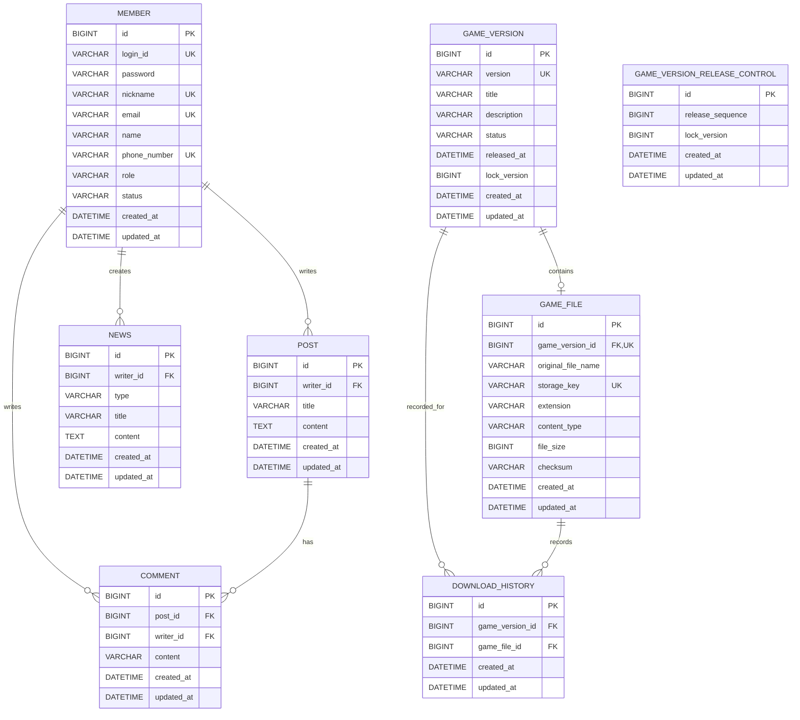

# Jexon ERD 설계

## 1. 엔티티 목록
- Member
- Post
- Comment
- News
- GameVersion
- GameVersionReleaseControl
- GameFile
- DownloadHistory

---

## 2. 관계 요약
- Member 1:N Post
- Member 1:N Comment
- Post 1:N Comment
- GameVersion 1:1 GameFile
- GameVersion 1:N DownloadHistory
- GameFile 1:N DownloadHistory
- Member 1:N News

DownloadHistory는 Member와 관계를 맺지 않는다.

---

## 3. Member

### 테이블명

`members`

| 컬럼 | 타입 | NULL | 제약조건 | 설명 |
|---|---|---:|---|---|
| id | BIGINT | N | PK, AUTO_INCREMENT | 회원 식별자 |
| login_id | VARCHAR(20) | N | UNIQUE | 로그인 아이디 |
| password | VARCHAR(255) | N |  | 암호화된 비밀번호 |
| nickname | VARCHAR(20) | N | UNIQUE | 닉네임 |
| email | VARCHAR(255) | N | UNIQUE | 이메일 |
| name | VARCHAR(60) | N |  | 이름 |
| phone_number | VARCHAR(20) | N | UNIQUE | 전화번호 |
| role | VARCHAR(20) | N |  | USER, ADMIN |
| status | VARCHAR(20) | N |  | ACTIVE, SUSPENDED, WITHDRAWN |
| created_at | DATETIME | N |  | 생성일 |
| updated_at | DATETIME | N |  | 수정일 |

### Enum

#### MemberRole
- USER
- ADMIN

#### MemberStatus
- ACTIVE
- SUSPENDED
- WITHDRAWN

### 제약조건
- login_id UNIQUE
- nickname UNIQUE
- email UNIQUE
- phone_number UNIQUE

---

## 4. Post

### 테이블명

`posts`

| 컬럼 | 타입 | NULL | 제약조건 | 설명 |
|---|---|---:|---|---|
| id | BIGINT | N | PK, AUTO_INCREMENT | 게시글 식별자 |
| writer_id | BIGINT | N | FK | 작성자 |
| title | VARCHAR(100) | N |  | 제목 |
| content | TEXT | N |  | 내용 |
| created_at | DATETIME | N |  | 작성일 |
| updated_at | DATETIME | N |  | 수정일 |

### 관계
- Member N:1 Post
- Post 1:N Comment

### 인덱스
Entity에는 별도 인덱스를 선언하지 않는다.

---

## 5. Comment

### 테이블명

`comments`

| 컬럼 | 타입 | NULL | 제약조건 | 설명 |
|---|---|---:|---|---|
| id | BIGINT | N | PK, AUTO_INCREMENT | 댓글 식별자 |
| post_id | BIGINT | N | FK | 게시글 |
| writer_id | BIGINT | N | FK | 작성자 |
| content | VARCHAR(1000) | N |  | 댓글 내용 |
| created_at | DATETIME | N |  | 작성일 |
| updated_at | DATETIME | N |  | 수정일 |

### 관계
- Post N:1 Comment
- Member N:1 Comment

### 인덱스
Entity에는 별도 인덱스를 선언하지 않는다. MySQL은 FK 인덱스를 생성한다.

---

## 6. News

### 테이블명

`news`

| 컬럼 | 타입 | NULL | 제약조건 | 설명 |
|---|---|---:|---|---|
| id | BIGINT | N | PK, AUTO_INCREMENT | 새소식 식별자 |
| writer_id | BIGINT | N | FK | 작성 관리자 |
| type | VARCHAR(20) | N |  | NOTICE, PATCH_NOTE, EVENT |
| title | VARCHAR(150) | N |  | 제목 |
| content | TEXT | N |  | 내용 |
| created_at | DATETIME | N |  | 작성일 |
| updated_at | DATETIME | N |  | 수정일 |

### Enum

#### NewsType
- NOTICE
- PATCH_NOTE
- EVENT

### 관계
- News N:1 Member
- `writer_id`는 NULL을 허용하지 않는다.
- 작성 관리자는 LAZY ManyToOne 관계로 저장한다.
- 현재 News는 GameVersion과 관계를 맺지 않는다.

### 인덱스
- 현재 Entity에 별도 인덱스를 선언하지 않는다.

---

## 7. GameVersion

### 테이블명

`game_versions`

| 컬럼 | 타입 | NULL | 제약조건 | 설명 |
|---|---|---:|---|---|
| id | BIGINT | N | PK, AUTO_INCREMENT | 버전 식별자 |
| version | VARCHAR(30) | N | UNIQUE | 버전 번호 |
| title | VARCHAR(100) | N |  | 버전 제목 |
| description | VARCHAR(500) | N |  | 버전 설명 |
| status | VARCHAR(20) | N |  | DRAFT, RELEASED, INACTIVE |
| released_at | DATETIME | Y |  | 실제 배포 일시 |
| lock_version | BIGINT | N | `@Version` | 개별 행 낙관적 락 버전 |
| created_at | DATETIME | N |  | 등록일 |
| updated_at | DATETIME | N |  | 수정일 |

### Enum

#### GameVersionStatus
- DRAFT
- RELEASED
- INACTIVE

### 관계
- GameVersion Entity에는 GameFile 필드를 추가하지 않는다.
- GameFile이 GameVersion을 참조하는 LAZY 단방향 OneToOne 관계의 주인이다.
- DownloadHistory는 GameVersion을 필수 LAZY ManyToOne으로 참조한다.
- News는 GameVersion과 관계가 없다.

### 제약조건
- version UNIQUE
- RELEASED 상태는 애플리케이션 정책상 최대 하나만 허용한다.

### 인덱스
Entity에는 별도 인덱스를 선언하지 않는다. `version` UNIQUE 인덱스가 존재한다.

---

## 7.1 GameVersionReleaseControl

### 테이블명

`game_version_release_control`

| 컬럼 | 타입 | NULL | 제약조건 | 설명 |
|---|---|---:|---|---|
| id | BIGINT | N | PK, 고정값 1 | singleton 식별자 |
| release_sequence | BIGINT | N |  | release 공통 변경 토큰 |
| lock_version | BIGINT | N | `@Version` | 집합 수준 낙관적 락 버전 |
| created_at | DATETIME | N |  | 생성일 |
| updated_at | DATETIME | N |  | 수정일 |

### 정책
- 현재 RELEASED 버전 ID나 version 문자열을 저장하지 않는다.
- latest Boolean을 저장하지 않는다.
- 모든 release 트랜잭션이 동일한 `id = 1` 행의 releaseSequence를 증가시킨다.
- 애플리케이션 시작 시 Initializer가 singleton 행의 존재를 확인하고 없으면 생성한다.

---

## 8. GameFile

구현된 파일 메타데이터 Entity다. 실제 파일 바이트는 LocalFileStorage에 저장하고 DB에는 저장 위치와 무결성 메타데이터를 저장한다.

### 테이블명

`game_files`

| 컬럼 | 타입 | NULL | 제약조건 | 설명 |
|---|---|---:|---|---|
| id | BIGINT | N | PK, AUTO_INCREMENT | 파일 식별자 |
| game_version_id | BIGINT | N | FK, UNIQUE | 연결 게임 버전 |
| original_file_name | VARCHAR(255) | N |  | 경로 제거 및 NFC 정규화된 원본 파일명 |
| storage_key | VARCHAR(500) | N | UNIQUE | `game-files/{gameVersionId}/{UUID}.zip` 내부 키 |
| extension | VARCHAR(20) | N |  | 파일 확장자 |
| content_type | VARCHAR(255) | Y |  | 선택적 MIME 보조 메타데이터 |
| file_size | BIGINT | N |  | 파일 크기(byte) |
| checksum | VARCHAR(64) | N |  | SHA-256 |
| created_at | DATETIME | N |  | 업로드 일시 |
| updated_at | DATETIME | N |  | 수정일 |

### 관계
- GameVersion 1:1 GameFile
- GameFile이 관계의 주인이며 LAZY 단방향 OneToOne이다.

### 제약조건
- game_version_id UNIQUE
- storage_key UNIQUE
- `file_size > 0` CHECK
- 한 게임 버전에는 하나의 파일만 연결된다.

### 보안 정책
- storage_key와 실제 저장 경로는 API 응답에 포함하지 않는다.
- content_type은 ZIP 유효성 판단 기준으로 사용하지 않는다.

---

## 9. DownloadHistory

정상적으로 다운로드 응답을 시작할 수 있었던 요청을 기록하는 구현 완료 Entity다.

### 테이블명

`download_histories`

| 컬럼 | 타입 | NULL | 제약조건 | 설명 |
|---|---|---:|---|---|
| id | BIGINT | N | PK, AUTO_INCREMENT | 다운로드 이력 식별자 |
| game_version_id | BIGINT | N | FK | 다운로드 버전 |
| game_file_id | BIGINT | N | FK | 다운로드 파일 |
| created_at | DATETIME | N |  | 다운로드 응답 시작 가능 시각 |
| updated_at | DATETIME | N |  | 수정 일시, BaseTimeEntity 상속 |

### 관계
- DownloadHistory N:1 GameVersion
- DownloadHistory N:1 GameFile
- 두 관계는 LAZY이며 필수다.
- cascade와 orphanRemoval은 설정하지 않는다.

### 인덱스
Step 6에서도 별도 통계 인덱스는 추가하지 않았다. `game_version_id`는 현재 MySQL FK 인덱스를 활용할 수 있다. `created_at` 기반 일별 집계 인덱스는 DownloadHistory 데이터 증가와 실행계획을 확인한 뒤 추가 여부를 검토한다.

---

## 10. 공통 시간 컬럼
다음 엔티티는 생성일과 수정일을 가진다.

- Member
- Post
- Comment
- News
- GameVersion
- GameVersionReleaseControl
- GameFile
- DownloadHistory

JPA Auditing을 사용한다.

DownloadHistory는 BaseTimeEntity를 상속하며 createdAt을 다운로드 시각으로 사용한다.

---

## 11. 삭제 정책

### Member
초기 MVP에서는 회원 탈퇴 API를 구현하지 않는다.

향후 탈퇴 기능을 추가할 경우 데이터 삭제보다 `WITHDRAWN` 상태 변경을 우선 검토한다.

### Post 및 Comment
초기 MVP에서는 실제 삭제한다.

향후 운영 이력 보존이 필요하면 논리 삭제로 변경한다.

### News
관리자가 실제 삭제한다.

### GameVersion 및 GameFile
- GameVersion 삭제 API와 자동 삭제 정책은 제공하지 않는다.
- GameVersion 메타데이터는 상태와 관계없이 보존한다.
- GameFile 교체 및 삭제 API는 현재 제공하지 않는다.

### DownloadHistory
통계 원본 데이터이므로 관리자 화면에서 삭제 기능을 제공하지 않는다.

---

## 12. Mermaid ERD

아래 다이어그램은 현재 구현된 Entity를 표시한다.
GameVersion과 GameFile 관계는 GameFile에서 GameVersion으로 향하는 단방향 관계로 운영 코드에 반영되어 있다.

---

## 13. 향후 검토 사항
- 게시글 조회 수 동시 증가 방식
- 향후 GameFile 교체 및 삭제 정책
- 실제 물리 파일 release 재검증 방식
- DownloadHistory 증가 시 created_at 기반 일별 통계 인덱스 필요 여부
